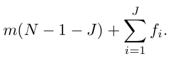
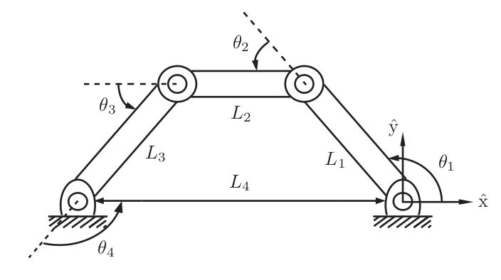
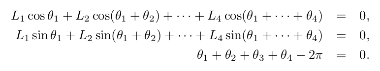
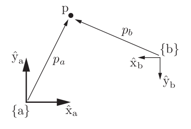

# Course 1: Foundations of Robot Motion

## Configuration Space

Robot configuration: a specification of the positions of all points of the robot.

## Degree of Freedom

The number of degrees of freedom (dof) of a robot is the smallest number of real-valued coordinates needed to represent its configuration.
 
degrees of freedom = (sum of freedoms of the bodies) − (number of independent constraints).
 
A 2D planner body can have maximum 3 DOF - 2 translation in the plane itself and one rotation about the axis coming out the plane.
 
A 3D rigid body can have maximum 6 DOF - 3 in Rotational and 3 in translation about the unit axis x,y,z.

## Grubler's Formula

Consider a mechanism consisting of N links, where ground
is also regarded as a link. Let J be the number of joints, m be the number of
degrees of freedom of a rigid body (m = 3 for planar mechanisms and m = 6 for
spatial mechanisms), fi be the number of freedoms provided by joint i, and ci be
the number of constraints provided by joint i, where fi + ci = m for all i. Then Degree of Freedom (DOF) is given by, 

	

## C-Space Topology

Topology can be considered as the shape or the orientation of the surface.
 
Two spaces are topologically equivalent if one can be continuously deformed into the other without cutting or gluing.
 
Topology is independent of how we represent the space.

## C-space representation

An implicit representation views the n-dimensional space as embedded in a Euclidean space of more than n dimensions.

	

The DOF of above 4-Bar linkage can we calculated using Grubler's formula which is 1. 
1 DOF implies that the orientation of this 4-Bar linkage mechanism can be represented using single parameter/variable, which will be hard to derive and may contain singularities.
 
PS: A singularity is a particular point in a robot's workspace that causes the robot to lose one or more degrees of freedom (DoF)
 
Instead we can the orientation of the mechanism using four parameters that is with 4-DOF subject to to 3 constrains leading to 1-DOF.
 
This can be alternatively stated as 1D space embed in 4D space of θ1, θ2, θ3 and θ4.

	

 
Holonomic constrains reduce the C-space and thus the DOF of the robot.
 
Non-holonomic constraints do not limit the C-space dimension but limit the motion of the robot (e.g. translation motion of a car).

 

**Velocities are not the time derivatives of coordinates.**

## Task Space and Workspace

The task space is a space in which the robot’s task can be naturally ex-
pressed. We only need to know about the task and not the robot to define the task space.

 
The workspace is a specification of the configurations that the -effector of the robot can reach. The workspace is independent of task the robot has to do and depends on the range of motion of the robot.

## Rigid Body Motion

The configuration and position of a rigid body can be represented using a 4x4 matrix which can be obtained by applying tem constrains to a 16-D space.

 
A rigid body’s velocity, however, can be represented by three angular
velocities and three linear velocities, which together we call a spatial velocity or twist.

 
To represent any point in space we first need to define a frame of reference. Any representation is then done relative to this frame. The origin of this reference frame is considered as zero-point.
This reference frame is called as space frame denoted by {s}.
We also attach a body frame to our robot or the rigid body which is going to be observed, denoted by {b}.
 As the rigid body moves the frame associated with it also moves.

 

 

	

The point p exists in physical space, and it does not care how we represent it. If we fix a reference frame {a}, with unit coordinate axes x̂a and ŷa , we can represent p as pa = (1, 2). If we fix a reference frame {b} at a different location, a different orientation, and a different length scale, we can represent p as pb = (4, −2).

 
To describe the configuration of the planar body, only the position and
orientation of the body frame with respect to the fixed frame need to be specified.

 

$$
\begin{matrix}
    a & b \\
    c & d \\
\end{matrix}
$$

 

## Rotation Matrix

## Angular Velocities

## Exponential Coordinate Representation

## Homogenous Transformation Matrix

## Twist

## Screw

## Exponential Coordinates

## Wrench