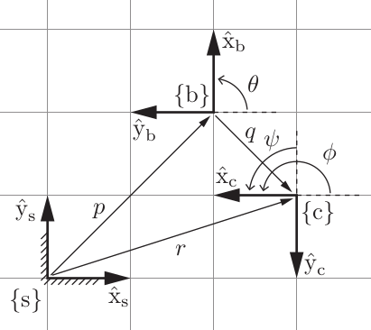
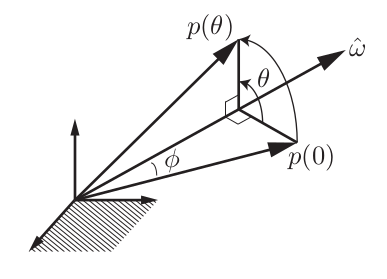
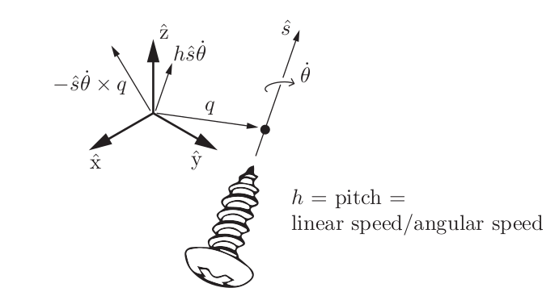

# Course 1: Foundations of Robot Motion

## Configuration Space

Robot configuration: a specification of the positions of all points of the robot.

## Degree of Freedom

The number of degrees of freedom (dof) of a robot is the smallest number of real-valued coordinates needed to represent its configuration.
 
degrees of freedom = (sum of freedoms of the bodies) − (number of independent constraints).
 
A 2D planner body can have maximum 3 DOF - 2 translation in the plane itself and one rotation about the axis coming out the plane.
 
A 3D rigid body can have maximum 6 DOF - 3 in Rotational and 3 in translation about the unit axis x,y,z.

## Grubler's Formula

Consider a mechanism consisting of N links, where ground
is also regarded as a link. Let J be the number of joints, m be the number of
degrees of freedom of a rigid body (m = 3 for planar mechanisms and m = 6 for
spatial mechanisms), fi be the number of freedoms provided by joint i, and ci be
the number of constraints provided by joint i, where fi + ci = m for all i. Then Degree of Freedom (DOF) is given by, 

$$
DOF = m (N-1-J) + \sum_{i=1}^{J} f_i
$$

## C-Space Topology

Topology can be considered as the shape or the orientation of the surface.
 
Two spaces are topologically equivalent if one can be continuously deformed into the other without cutting or gluing.
 
Topology is independent of how we represent the space.

## C-space representation

An implicit representation views the n-dimensional space as embedded in a Euclidean space of more than n dimensions.

	

The DOF of above 4-Bar linkage can we calculated using Grubler's formula which is 1. 
1 DOF implies that the orientation of this 4-Bar linkage mechanism can be represented using single parameter/variable, which will be hard to derive and may contain singularities.
 
PS: A singularity is a particular point in a robot's workspace that causes the robot to lose one or more degrees of freedom (DoF)
 
Instead we can the orientation of the mechanism using four parameters that is with 4-DOF subject to to 3 constrains leading to 1-DOF.
 
This can be alternatively stated as 1D space embed in 4D space of θ1, θ2, θ3 and θ4.

$$
L_1 cos(\theta_1) + L_2 cos(\theta_1+\theta_2) + ... + L_4 cos(\theta_1 + ...+ \theta_1) = 0
$$

$$
L_1 sin(\theta_1) + L_2 sin(\theta_1+\theta_2) + ... + L_4 sin(\theta_1 + ...+ \theta_1) = 0
$$

$$
\theta_1 + \theta_1 +\theta_1 + \theta_1 - 2\pi= 0
$$

 
Holonomic constrains reduce the C-space and thus the DOF of the robot.
 
Non-holonomic constraints do not limit the C-space dimension but limit the motion of the robot (e.g. translation motion of a car).

 

**Velocities are not the time derivatives of coordinates.**

## Task Space and Workspace

The task space is a space in which the robot’s task can be naturally ex-
pressed. We only need to know about the task and not the robot to define the task space.

 
The workspace is a specification of the configurations that the -effector of the robot can reach. The workspace is independent of task the robot has to do and depends on the range of motion of the robot.

## Rigid Body Motion

The configuration and position of a rigid body can be represented using a 4x4 matrix which can be obtained by applying tem constrains to a 16-D space.

 
A rigid body’s velocity, however, can be represented by three angular
velocities and three linear velocities, which together we call a spatial velocity or twist.

 
To represent any point in space we first need to define a frame of reference. Any representation is then done relative to this frame. The origin of this reference frame is considered as zero-point.
This reference frame is called as space frame denoted by {s}.
We also attach a body frame to our robot or the rigid body which is going to be observed, denoted by {b}.
 As the rigid body moves the frame associated with it also moves.

 
 

	

The point p exists in physical space, and it does not care how we represent it. If we fix a reference frame {a}, with unit coordinate axes x̂a and ŷa , we can represent p as pa = (1, 2). If we fix a reference frame {b} at a different location, a different orientation, and a different length scale, we can represent p as pb = (4, −2).

 
To describe the configuration of the planar body, only the position and
orientation of the body frame with respect to the fixed frame need to be specified.

 
 

	

The frame {b} in {s} is given by (P, p), and the frame {c} in {b} is given
by (Q, q). From these we can derive the frame {c} in {s}, described by (R, r). The
numerical values of the vectors p, q, and r and the coordinate-axis directions of the
three frames are evident from the grid of unit squares.

 

ψ is the amount of rotation required to convert x̂b to x̂c.

 
point p which is the origin of frame {b} can be represented as column vector,

$$
p = \begin{bmatrix}
    p_{x}  \\
    p_{y}
\end{bmatrix}
$$

this is nothing but translation matrix for frame {b}

 
the two vectors x̂c and ŷb can be represented as,

$$
P = \begin{bmatrix}
    x̂_{b}  &
    ŷ_{b}
\end{bmatrix}
= \begin{bmatrix}
    x̂_{s}.cos(\theta) & -x̂_s.sin(\theta) \\
    p_{s}.sin(\theta) & ŷ_s.cos(\theta)
\end{bmatrix}
$$

Matrix P is called as **Rotation matrix**

Together, the pair (P, p) provides a description of the orientation and position of {b} relative to {s}.

If we know (Q, q) (the configuration of {c} relative to {b}) and (P, p) (the configuration of {b} relative to {s}), we can compute the configuration of {c} relative to {s} as follows:

$$
R = PQ \quad (\text{convert } Q \text{ to the } {s} \text{ frame})
$$

Something like:

$$
\phi = \theta + \psi
$$

and

$$
r = P q + p \quad (\text{convert } q \text{ to the } {s} \text{ frame and vector-sum with } p).
$$

It does matter if we pre-multiply or post-multiply the rotational matrix <i>P</i>

This concept can be generalized to 3D, to represent the frame {b} in fixed frame {s}, where the unit axes of the fixed frame is represented by {x̂s , ŷs , ẑs} and the unit axes of the body frame by {x̂b , ŷb , ẑb}.

Let p denote the vector from the fixed-frame origin to the body-frame origin. In terms of the fixed-frame coordinates, p can be expressed as,

$$
p = p_1x̂_s + p_2ŷ_s + p_3ẑ_s
$$

The axes of the body frame can also be expressed as

$$
x̂_b = r_{11}x̂_s + r_{21}ŷ_s + r_{31}ẑ_s
$$
$$
ŷ_b = r_{12}x̂_s + r_{22}ŷ_s + r_{32}ẑ_s
$$
$$
ẑ_b = r_{13}x̂_s + r_{23}ŷ_s + r_{33}ẑ_s
$$

In matrix form these can represented as,
$$
p = \begin{bmatrix}
    p_{1}  &
    p_{2}  &
    p_3
\end{bmatrix}
\quad \quad
R = \begin{bmatrix}
    x̂_b  &
    ŷ_b  &
    ẑ_b
\end{bmatrix}
=\begin{bmatrix}
    r_{11} & r_{12} & r_{13} \\
    r_{21} & r_{22} & r_{23} \\
    r_{31} & r_{32} & r_{33}
\end{bmatrix}
$$

the 12 parameters given by (R, p) then provide a description of the position and orientation of the rigid body relative to the fixed frame.
Since the orientation of a rigid body has three degrees of freedom, only three of the nine entries in R can be chosen independently.

## Rotation Matrix

The matrix R is called the rotational matrix.

AS discussed the only three entries in R can be chosen independently that implies 6 constrains will be imposed on matrix R, which are:

Each Column of matrix R will be a unit vector (sum of squares of coefficient which are r12 ... will be 1 for each column),

and those unit vectors will be orthogonal to each other(dot product of vectors is zero),

**Properties of Rotational Matrix**
$$
R^TR = I
$$

$$
detR = 1
$$

Matrixes which satisfy these properties are called as special orthogonal group SO(3)

**Uses of Rotation Matrix**

1. To represent an orientation,

Rac denotes orientation of c with respect to a.

By property of rotational matrix,

$$
R_{ab} = R_{ba}^{-1} = R_{ba}^T
$$

2. To change the frame of reference in which a vector is represented,

To represent a vector p which is currently represented in frame b to frame a, simply pre-multiply with rotational matrix of b wrt a.

$$
p_a = R_{ab}p_b
$$

Similar operation can be performed to represent a frame in some other frame.

3. To rate a vector or a frame (represent a vector in another frame).

A frame represented in other frame is actually rotated in that frame.

## Angular Velocities

**Skew-symmetric notation**
A vector.
$$
x = \begin{bmatrix}
    x_1 \\
    x_2 \\
    x_3 
\end{bmatrix}
$$

The skew-symmetric representation of x is,

$$
\begin{bmatrix}
    x
\end{bmatrix} =
\begin{bmatrix}
    0 & -x_3 & x_2 \\
    x_3 & 0 & -x_1 \\
    -x_2 & x_1 & 0
\end{bmatrix}
$$

When a frame is rotated, the rotation can be considered about an axis ω represented in {s} frame and angle θ about that axis.

## Exponential Coordinate Representation

The exponential coordinates parametrize
a rotation matrix in terms of a rotation axis (represented by a unit vector ω̂ ) and an angle of rotation θ about that axis; the vector ω̂θ ∈ R3 then serves as the three-parameter exponential coordinate representation of the rotation. Writing ω̂ and θ individually is the axis-angle representation of a rotation.
The exponential coordinate representation ω̂θ for a rotation matrix R can
be interpreted equivalently as:
- the axis ω̂ and rotation angle θ such that, if a frame initially coincident with {s} were rotated by θ about ω̂, its final orientation relative to {s} would be expressed by R; or
- the angular velocity ω̂θ expressed in {s} such that, if a frame initially
coincident with {s} followed ω̂θ for one unit of time (i.e., ω̂θ is integrated
over this time interval), its final orientation would be expressed by R; or
- the angular velocity ω̂ expressed in {s} such that, if a frame initially
coincident with {s} followed ω̂ for θ units of time (i.e., ω̂ is integrated over
this time interval) its final orientation would be expressed by R.

 
 

	

The vector p(0) is rotated by an angle θ about the axis ω̂, to p(θ).

Rate of change of p is denoted by  
$$
ω̂  * p(t)
$$
$$
\implies ṗ(t) = ω̂  * p(t)
$$
With reference to  skew symmetric matrix representation,
$$
ṗ = \begin{bmatrix}
    \omega
\end{bmatrix}p
$$
$$
p(\theta) = e^{\begin{bmatrix}
    \omega
\end{bmatrix}\theta}p(0)
$$

Given a vector ω̂θ ∈ R3 , such that θ is any scalar and ω̂ ∈ R3 is a unit vector, the matrix exponential of [ω̂]θ = [ω̂θ] ∈ so(3) is,

$$
Rot(ω̂, \theta) =  e^{\begin{bmatrix}
    \omega
\end{bmatrix}\theta} = I + sin\theta \begin{bmatrix}
    \omega
\end{bmatrix} + (1-cos \theta) \begin{bmatrix}
    \omega
\end{bmatrix}^2 \in SO(3)
$$

Conversion,
$$
exp: \begin{bmatrix}
    ω̂   
\end{bmatrix} \theta \in so(3) \implies R \in SO(3)
$$

$$
log: R \in SO(3) \implies \begin{bmatrix}
    ω̂   
\end{bmatrix} \theta \in so(3) 
$$

## Homogenous Transformation Matrix

Homogenous transformation matrix is a combination of rotation matrix and vector p to represent the orientation of an rigid body using a single matrix.

$$
T = 
\begin{bmatrix}
    R & p \\
    0 & 1
\end{bmatrix}
$$

also known as special euclidean group SE(3),

Properties,

$$
T^{-1}= 
\begin{bmatrix}
    R & p \\
    0 & 1
\end{bmatrix}^{-1} = 
\begin{bmatrix}
    R^T & -R^Tp \\
    0 & 1
\end{bmatrix}
$$

Uses of transformation matrix is same as rotational matrix,

If we want to displace a vector of a frame, we simply multiply the transformation matrix by that vector of frame, care should be taken if the transformation matrix is being pre-multiplied or post multiplied.

when pre-multiplied,

TTsb , ω and p about which the transformation is happening  is represented in {s} frame.

(Transforming frame Tsb by multiplying it with T transformation matrix.)

and when post-multiplied,

TsbT , ω and p about which the transformation is happening  is represented in {b} frame.

## Twist
Twist is combined representation of angular and linear velocities of the rigid body.

$$
V_b = \begin{bmatrix}
    \omega_b \\
    v_b
\end{bmatrix}
$$

$$
\begin{bmatrix}
    V_b
\end{bmatrix} = \begin{bmatrix}
   \begin{bmatrix}
    \omega_b
\end{bmatrix} & v_b \\
0 & 1
\end{bmatrix}
$$

called as spatial velocities.

Twists can be transformed from one frame to other,

$$
\begin{bmatrix}
    V_b
\end{bmatrix} = T_{sb}^{-1}  \begin{bmatrix}
    V_s
\end{bmatrix} T
$$

Adjoint representation of a transformation matrix,

$$
\begin{bmatrix}
    Ad_T
\end{bmatrix} = \begin{bmatrix}
    R & 0 \\ \begin{bmatrix}
    p
\end{bmatrix} R & R
\end{bmatrix}
$$

## Screw

As we had ω and θ to represent rotational axis for pure rotational motion,
Screw axis is the one which can be used to represent rotational as well as linear motion.

 
 

	

A screw axis S represented by a point q, a unit direction ŝ, and a pitch
h.

For a given frame screw axis is represented as,

$$
S = \begin{bmatrix}
    \omega \\
    v
    \end{bmatrix}
$$

## Exponential Coordinates

By analogy to the exponential coordinates ω̂θ for rotations, we define the six-dimensional exponential coordinates of a homogeneous transformation
T as Sθ ∈ R6

$$
exp: \begin{bmatrix}
    S  
\end{bmatrix} \theta \in se(3) \implies T \in SE(3)
$$

$$
log: T \in SE(3) \implies \begin{bmatrix}
    S  
\end{bmatrix} \theta \in se(3) 
$$

## Wrench

**Moment** or **torque** of a force *fa* acting on a rigid body at point r represented as *ra* in frame {a} is:

$$
m_a = r_a * f_a
$$

Just as with twists, we can merge the moment and force into a single six- dimensional spatial force, or wrench, expressed in the {a} frame, Fa :

$$
F_a = \begin{bmatrix}
    m_{a}  \\
    f_{a}
\end{bmatrix}
∈ ℝ^6
$$

Wrenches can be transformed from one frame to other using the fact that the power generated (dissipated) by an  wrench-twist pair must be same regardless of the frame in which they are represented.

$$
F_b = {Ad_{T_{ab}}}^{T} (F_a) = 
\begin{bmatrix}
    {Ad_{T_{ab}}}  \\
\end{bmatrix}^T
F_a
$$

$$
F_a = {Ad_{T_{ba}}}^{T} (F_b) = 
\begin{bmatrix}
    {Ad_{T_{ba}}}  \\
\end{bmatrix}^T
F_b
$$