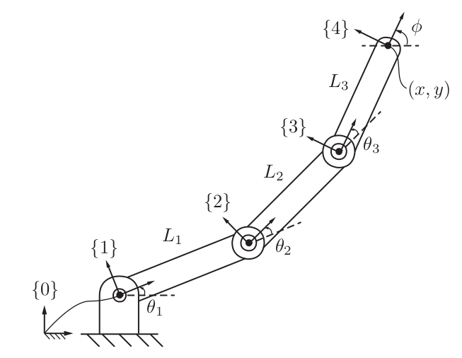

# Course 1: Robot Kinematics

## Forward Kinematics

The forward kinematics of a robot refers to the calculation of the position and orientation of its end-effector frame from its joint coordinates θ.

	

The simplest way to represent the orientation and position of the end-effector is to attach frames to each individual link and find the homogenous transformation of the end effector with respect to {s} frame.

$$
T_{04} = T_{01}T_{12}T_{23}T_{34}
$$

using subscription cancellation method.

where,

$$
T_{01} = \begin{bmatrix}
    cos\theta_1 & -sin\theta_1 & 0 & 0 \\
    sin\theta_1 & cos\theta_1 & 0 & 0 \\
    0 & 0 & 1 & 0 \\
    0 & 0 & 0 & 1
\end{bmatrix} 
$$

$$
T_{12} = \begin{bmatrix}
    cos\theta_2 & -sin\theta_2 & 0 & L_1 \\
    sin\theta_2 & cos\theta_2 & 0 & 0 \\
    0 & 0 & 1 & 0 \\
    0 & 0 & 0 & 1
\end{bmatrix} 
$$

$$
T_{23} = \begin{bmatrix}
    cos\theta_3 & -sin\theta_3 & 0 & L_2 \\
    sin\theta_3 & cos\theta_3 & 0 & 0 \\
    0 & 0 & 1 & 0 \\
    0 & 0 & 0 & 1
\end{bmatrix} 
$$

$$
T_{34} = \begin{bmatrix}
    1 & 0 & 0 & L_3 \\
    0 & 1 & 0 & 0 \\
    0 & 0 & 1 & 0 \\
    0 & 0 & 0 & 1
\end{bmatrix}
$$

**Alternatively,** we can represent

$$
T_{04} = e^{\begin{bmatrix}S_1\end{bmatrix}\theta_1}e^{\begin{bmatrix}S_2\end{bmatrix}\theta_2}e^{\begin{bmatrix}S_3\end{bmatrix}\theta_3}e^{\begin{bmatrix}S_4\end{bmatrix}\theta_4}M
$$

where,

$$
M = \begin{bmatrix}
    1 & 0 & 0 & L_1 + L_2 + L_3 \\
    0 & 1 & 0 & 0 \\
    0 & 0 & 1 & 0 \\
    0 & 0 & 0 & 1
\end{bmatrix}
$$

M is the position and orientation of frame {4} when all joints angles are set to zero position which is,

and 

S1, S2, S3 are screw axis corresponding to rotation about respective joint while joints at zero position

$$
S_1 = \begin{bmatrix}
    \omega_1\\
    v_1
\end{bmatrix} = \begin{bmatrix}
    0\\
    0 \\
    1 \\
    0 \\
    0 \\
    0
\end{bmatrix}
$$

$$
S_2 = \begin{bmatrix}
    0\\
    0 \\
    1 \\
    0 \\
    -L_1 \\
    0
\end{bmatrix}
$$

$$
S_3 = \begin{bmatrix}
    0\\
    0 \\
    1 \\
    0 \\
    -L_1 - L_2 \\
    0
\end{bmatrix}
$$

### Product of Exponential Formula

Even if have multiple joints we can represent the end-effector based upon the joint angle given the fact we know the zero position of the end-effector.

$$
T(\theta) = e^{\begin{bmatrix}S_1\end{bmatrix}\theta_1}...e^{\begin{bmatrix}S_{n-1}\end{bmatrix}\theta_{n-1}}e^{\begin{bmatrix}S_n\end{bmatrix}\theta_n}M
$$

the screw axes being represented in fixed space frame.

Moreover we can also represent the screw axes in the frame of end-effector which is {b}

The formula then transforms to,

$$
T(\theta) = Me^{\begin{bmatrix}B_1\end{bmatrix}\theta_1}...e^{\begin{bmatrix}B_{n-1}\end{bmatrix}\theta_{n-1}}e^{\begin{bmatrix}B_n\end{bmatrix}\theta_n}
$$

where B are the screw axes represented in {b} frame.

**Note:** Programming question number 4 and 5 of Week 1 if solved in MATLAB produce wrong answer hence needs to be solved in python.