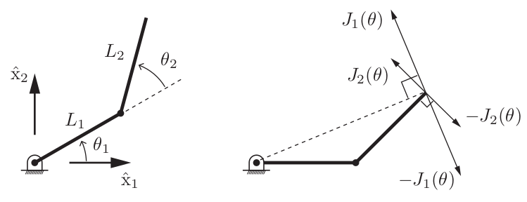
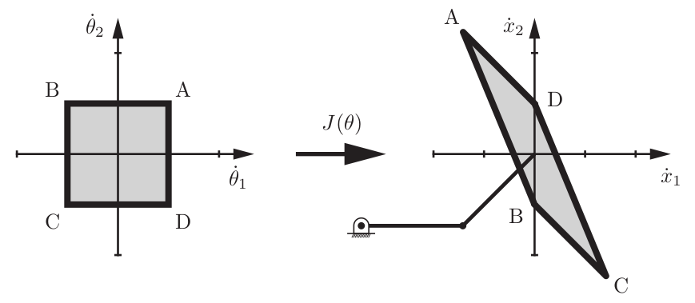
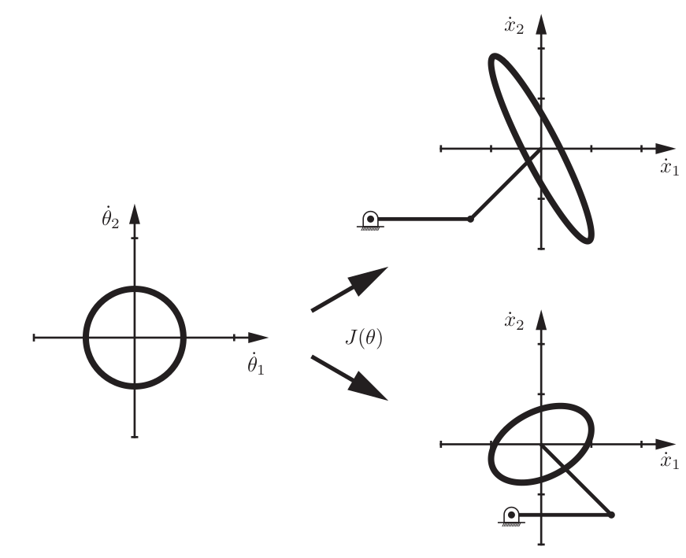
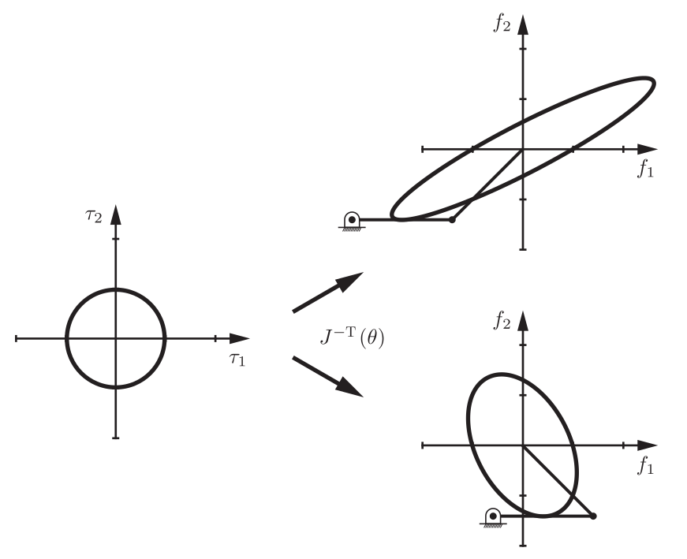
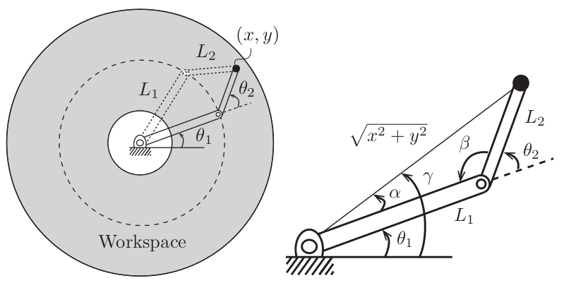
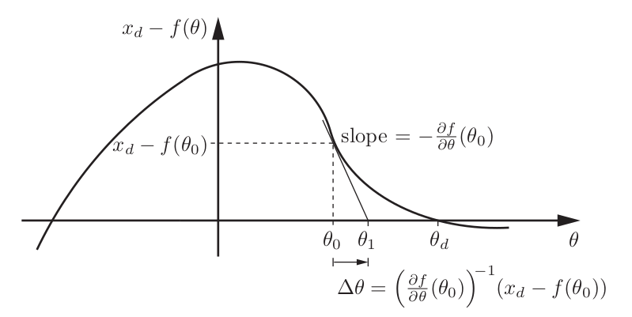
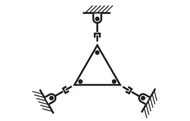
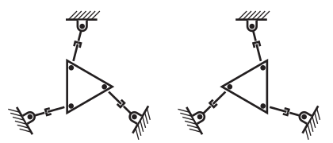

# Course 1: Robot Kinematics

## Forward Kinematics

The forward kinematics of a robot refers to the calculation of the position and orientation of its end-effector frame from its joint coordinates θ.

	

The simplest way to represent the orientation and position of the end-effector is to attach frames to each individual link and find the homogenous transformation of the end effector with respect to {s} frame.

$$
T_{04} = T_{01}T_{12}T_{23}T_{34}
$$

using subscription cancellation method.

where,

$$
T_{01} = \begin{bmatrix}
    cos\theta_1 & -sin\theta_1 & 0 & 0 \\
    sin\theta_1 & cos\theta_1 & 0 & 0 \\
    0 & 0 & 1 & 0 \\
    0 & 0 & 0 & 1
\end{bmatrix} 
$$

$$
T_{12} = \begin{bmatrix}
    cos\theta_2 & -sin\theta_2 & 0 & L_1 \\
    sin\theta_2 & cos\theta_2 & 0 & 0 \\
    0 & 0 & 1 & 0 \\
    0 & 0 & 0 & 1
\end{bmatrix} 
$$

$$
T_{23} = \begin{bmatrix}
    cos\theta_3 & -sin\theta_3 & 0 & L_2 \\
    sin\theta_3 & cos\theta_3 & 0 & 0 \\
    0 & 0 & 1 & 0 \\
    0 & 0 & 0 & 1
\end{bmatrix} 
$$

$$
T_{34} = \begin{bmatrix}
    1 & 0 & 0 & L_3 \\
    0 & 1 & 0 & 0 \\
    0 & 0 & 1 & 0 \\
    0 & 0 & 0 & 1
\end{bmatrix}
$$

**Alternatively,** we can represent

$$
T_{04} = e^{\begin{bmatrix}S_1\end{bmatrix}\theta_1}e^{\begin{bmatrix}S_2\end{bmatrix}\theta_2}e^{\begin{bmatrix}S_3\end{bmatrix}\theta_3}e^{\begin{bmatrix}S_4\end{bmatrix}\theta_4}M
$$

where,

$$
M = \begin{bmatrix}
    1 & 0 & 0 & L_1 + L_2 + L_3 \\
    0 & 1 & 0 & 0 \\
    0 & 0 & 1 & 0 \\
    0 & 0 & 0 & 1
\end{bmatrix}
$$

M is the position and orientation of frame {4} when all joints angles are set to zero position which is,

and 

S1, S2, S3 are screw axis corresponding to rotation about respective joint while joints at zero position

$$
S_1 = \begin{bmatrix}
    \omega_1\\
    v_1
\end{bmatrix} = \begin{bmatrix}
    0\\
    0 \\
    1 \\
    0 \\
    0 \\
    0
\end{bmatrix}
$$

$$
S_2 = \begin{bmatrix}
    0\\
    0 \\
    1 \\
    0 \\
    -L_1 \\
    0
\end{bmatrix}
$$

$$
S_3 = \begin{bmatrix}
    0\\
    0 \\
    1 \\
    0 \\
    -L_1 - L_2 \\
    0
\end{bmatrix}
$$

### Product of Exponential Formula

Even if have multiple joints we can represent the end-effector based upon the joint angle given the fact we know the zero position of the end-effector.

$$
T(\theta) = e^{\begin{bmatrix}S_1\end{bmatrix}\theta_1}...e^{\begin{bmatrix}S_{n-1}\end{bmatrix}\theta_{n-1}}e^{\begin{bmatrix}S_n\end{bmatrix}\theta_n}M
$$

the screw axes being represented in fixed space frame.

Moreover we can also represent the screw axes in the frame of end-effector which is {b}

The formula then transforms to,

$$
T(\theta) = Me^{\begin{bmatrix}B_1\end{bmatrix}\theta_1}...e^{\begin{bmatrix}B_{n-1}\end{bmatrix}\theta_{n-1}}e^{\begin{bmatrix}B_n\end{bmatrix}\theta_n}
$$

where B are the screw axes represented in {b} frame.

**Note:** Programming question number 4 and 5 of Week 1 if solved in MATLAB produce wrong answer hence needs to be solved in python.

## Velocity Kinematics 

Apart from position and orientation of the end-effector it is also important to take into account the velocities and forces applied by the end-effector.

Rate of change of end-effector can be expressed as function of joint angles which are in turn function of time.

$$
x(t) = f(\theta(t))
$$

by chain rule,

$$
ẋ = 
\frac{\partial f(\theta) d\theta (t)}{\partial \theta dt}
= \frac{\partial f(\theta)}{\partial \theta}  \dot{\theta}
= J(\theta) \dot{\theta}
$$

where, J(θ) is called the **Jacobian**. The Jacobian matrix represents
the linear sensitivity of the end-effector velocity ẋ to the joint velocity θ̇, and it
is a function of the joint variables θ.

Considering a 2R robot,

	

FK is defined by,

$$
x_1 = L_1cos\theta_1 + L_2cos(\theta_1 + \theta_2) \\
x_2 = L_1sin\theta_1 + L_2sin(\theta_1 + \theta_2) \\
$$

Differentiating and fusing into matrix we get,

$$
\begin{bmatrix}
    ẋ_1 \\
    ẋ_2
\end{bmatrix} =
\begin{bmatrix}
    -L_1sin\theta_1 -L_2sin(\theta_1 + \theta_2) & -L2sin(\theta_1 + \theta_2) \\
    L_1cos\theta_1 + L_2cos(\theta_1 + \theta_2) & L_2cos(\theta_1 + \theta_2)
\end{bmatrix}
\begin{bmatrix}
    \dot{\theta}_1 \\
    \dot{\theta}_2
\end{bmatrix}
$$

which can be written as,

$$
v_{tip} = J_1(\theta)\dot{\theta}_1 + J_2(\theta)\dot{\theta}_2
$$

this implies that current velocities of end effector depends on current values of angles as well as rate of change of joint angles.

	

At a particular configuration of robot various joint angle velocities produce various end effector velocities.

To note, Column i of the Jacobian matrix corresponds to the tip velocities when rate of change of ith joint is 1 and other joint velocities are zero.

Instead of square a circle is considered, this circle represents an
“iso-effort” contour in the joint velocity space, where total actuator effort is considered to be the sum of squares of the joint velocities. This circle maps through the Jacobian to an ellipse in the space of tip velocities, and this ellipse is referred to as the manipulability ellipsoid.

	

Manipulability ellipsoids for two different postures of the 2R planar open
chain.

As the manipulator configuration approaches a singularity, the ellipse collapses to a line segment, since the ability of the tip to move in one direction is lost.

the Jacobian can also be used to find the joint torques required to produce a wrench at the end effectors tip.

	

Force ellipsoids for two different postures of the 2R planar open chain.

For a given joint velocity vectors the twist of end effector is denoted by,

$$
V_s = J_s(\theta)\dot{\theta}
$$

To find Jacobian, the ith column of Js(θ) (Jacobian represented in fixed frame space).

$$
J_{si}(\theta) = Ad_{e^{\begin{bmatrix}S_1\end{bmatrix}\theta_1}...  e^{\begin{bmatrix}S_{i-1}\end{bmatrix}\theta_{i-1}}}(S_i)
$$

and Jacobian represented in body frame in defined by, the ith column of Jb(θ)

$$
J_{bi}(\theta) = Ad_{e^-{\begin{bmatrix}B_n\end{bmatrix}\theta_n}... e^-{\begin{bmatrix}B_{i+1}\end{bmatrix}\theta_{i+1}}}(B_i)
$$

To convert body Jacobian to space Jacobian,

$$
J_s(\theta) = \begin{bmatrix}Ad_{T_{sb}}\end{bmatrix}J_b(\theta)
$$

## Statics of Open chains

If the robot end effector is expected to produce a wrench F then the torques required at the joint angles are given by,

$$
\tau = J_s^T(\theta)F_s
$$

## Singularity and Manipulability

Configuration at which robot's end effector loses ability to move instantaneously in one or more direction is known as singularity.

It is possible to analyze how close the current configuration of the robot is to reaching singularity using manipulability ellipsoid. 

## Inverse Kinematics

IK States that given a homogenous transform X ∈ SE(3) a solution θ is to be calculated that satisfies T(θ) = X.
Where FK id given joint vectors θ find the end effector configuration T(θ) of the robot.

Two methods can be adopted to solve IK of a robot:
1. Analytical close-from
    Utilize geometric of robot to produce non-linear equations and producing solutions to them. This methods cannot be generalized for all robots.

	

IK for this 2R can be solved using trigonometry.

$$
\theta_1 = tan^{-1}({\frac{y}{x}}) - cos^{-1}(\frac{x^2 + y^2 + {L_1}^2 - {L_2}^2}{2L_1\sqrt{x^2 + y^2}})
$$

$$
\theta_2 = \pi - cos^{-1}(\frac{{L_1}^2 + {L_2}^2 - x^2 - y^2}{2L_1L_2})
$$

2. Iterative numerical method
    Initially a guess is method for the solution and the algorithm drive the guess to the nearest solution.

What exactly we do is to find roots of the equation,

$$
x_d - f(\theta) = 0
$$

where xd is the required end-effector position and f(θ) is the position of the end-effector with given joint angles of the robot.

	

Algorithm:
1. initially we assume a θ0.
2. Find slope of curve at this θ, as we xd and f(θ) using FK.
3. Once slope is figured out we can find θ1
4. Find slope of curve at θ1 and repeat the process.

Eventually value of θ converges to solution close to θ0

## Kinematics of Closed Chains

Closed chain robots needs to satisfy loop closure equations.

Parallel robots are categorized under closed chain robots where a moving end effector is connected to through a set of actuated legs in parallel manner.

| Open chain Robots  | Close chain Robots |
| ------------- | ------------- |
| All joints are actuated  | Some joint may not be actuated  |
| Large Workspace  | Small Workspace  |
| Weak, Flexible | Strong, Stiff |
| FK straightforward | FK Tricky |
| IK tricky | IK relatively easy |

Close chain robots are more prone to singularities, such as this configuration of planner version of stewart platform with 6 rotational and 3 prismatic joint.

	

When prismatic joints are fully extended the mechanism could reach in either of the two positions.

	

